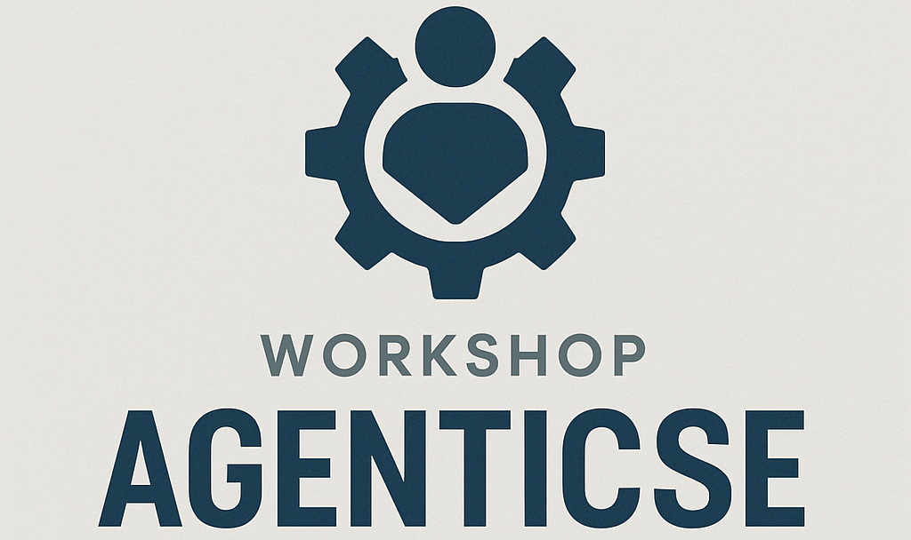
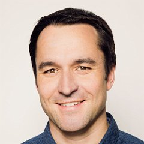
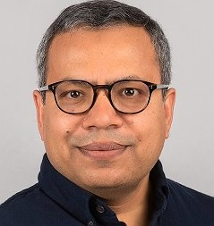
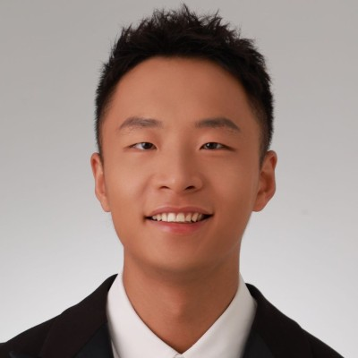
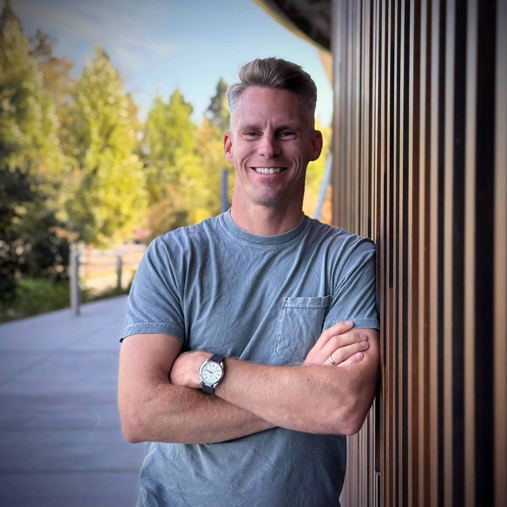
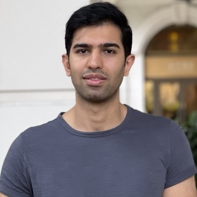
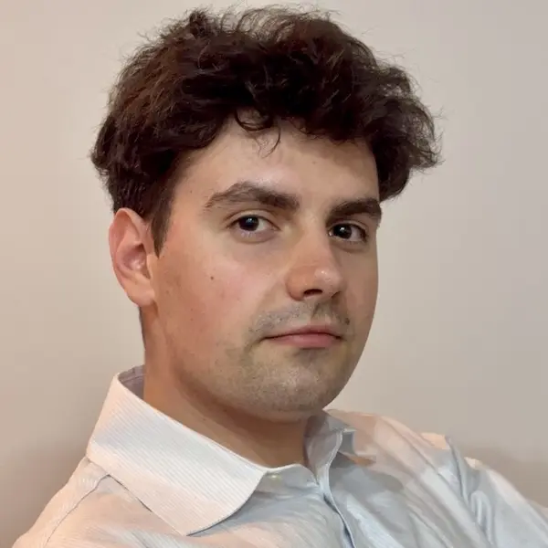
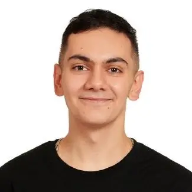

Autonomous agents powered by Large Language
Models are reshaping software engineering, enabling AI systems
that plan, code, test, and deploy with less human intervention. Despite rapid progress and growing industry interest, the Software
Engineering community lacks a dedicated venue to explore these
developments. The Autonomous Agents in Software Engineering
(AgenticSE) workshop aims to fill this gap by bringing together
researchers and practitioners to discuss agentic architectures,
applications in code generation, testing, DevOps, human-agent
collaboration, and evaluation. AgenticSE is a timely and essential
step toward building a community around this transformative
and underexplored direction in software engineering.

AgenticSE will be held on **November 20, 2025** co-located with ASE'25.

### Organizing Committee
<!-- 

  <figure style="text-align: center;">
    
    <figcaption>Maliheh Izadi, TU Delft</figcaption>
  </figure>

  <figure style="text-align: center;">
    
    <figcaption>Michael Pradel, Stuttgart</figcaption>
  </figure>

  <figure style="text-align: center;">
    
    <figcaption>Satish Chandra, Google</figcaption>
  </figure>

 -->

  <figure style="width: 33.33%; padding: 10px; box-sizing: border-box; margin: 0;">
    
    <figcaption style="margin-top: 10px; padding: 10px; border: 1px solid #ccc; background-color: #f9f9f9; font-weight: bold;">
      <a href="https://malihehizadi.github.io/">Maliheh Izadi</a>, TU Delft
    </figcaption>
  </figure>

  <figure style="width: 33.33%; padding: 10px; box-sizing: border-box; margin: 0;">
    
    <figcaption style="margin-top: 10px; padding: 10px; border: 1px solid #ccc; background-color: #f9f9f9; left; font-weight: bold;">
      <a href="https://software-lab.org/people/Michael_Pradel.html">Michael Pradel</a>, CISPA
    </figcaption>
  </figure>

  <figure style="width: 33.33%; padding: 10px; box-sizing: border-box; margin: 0;">
    
    <figcaption style="margin-top: 10px; padding: 10px; border: 1px solid #ccc; background-color: #f9f9f9; font-weight: bold;">
      <a href="https://sites.google.com/site/schandraacmorg/">Satish Chandra</a>, Google
    </figcaption>
  </figure>

### Speakers
We are excited to welcome distinguished speakers who will share their expertise on the role of agents in advancing software engineering, offering insights from both research and practice.

<strong><a href="https://chao-peng.github.io/">Dr. Chao Peng</a></strong> is a Principal Research Scientist at ByteDance. He received his PhD degree from The University of Edinburgh. At ByteDance, he leads the Trae Research team, where they conduct research on AI agents for software engineering including the application and evaluation of AI agents, and training LLMs for agents. He is also responsible for academic development and university collaboration. Dr. Chao Peng has published research and industry papers at premier venues including ICSE, FSE, ASE, ACL and serves as a PC member for FSE and ASE.

<strong><a href="https://alexandermossin.com/">Alexander Mossin</a></strong> is a software engineer with a passion for building beautiful and intelligent products who is currently at Google Labs, working on the next generation of AI tools. Alexander's primary expertise and interest is building robust distributed systems, ML infrastructure, automated evaluation solutions and data pipelines for AI. His team's mission is to harness cutting-edge AI to revolutionize the usefulness of AI and foundation models. His most recent accomplishments include launching AI-based video dubbing using foundation models and combining information retrieval with deep learning for medical records.

  <figure style="width: 50%; padding: 10px; box-sizing: border-box; margin: 0;">
    
    <figcaption style="margin-top: 10px; padding: 10px; border: 1px solid #ccc; background-color: #f9f9f9;">
      <strong><a href="https://chao-peng.github.io/">Chao Peng</a>, ByteDance</strong>
       
      <strong>Title</strong>: Trae Agent: SOTA Open-source AI Coding Agent for SWE-bench
       
      <strong>Abstract</strong>: In this talk, we spotlight Trae Agent’s remarkable achievement of securing the top position on the SWE-bench Verified leaderboard with a 75.2% success rate. Trae Agent, an intelligent LLM-based assistant, has demonstrated exceptional capabilities in autonomously debugging complex issues, implementing robust fixes, and navigating intricate codebases. This session will explore the methodologies behind Trae Agent’s performance, including its innovative patch generation and selection strategies, and the integration of multiple LLMs. Additionally, we will discuss the significance of making Trae Agent open-source, fostering community collaboration, and accelerating the evolution of AI in software development. 
    </figcaption>
  </figure>

  <figure style="width: 50%; padding: 10px; box-sizing: border-box; margin: 0;">
    
    <figcaption style="margin-top: 10px; padding: 10px; border: 1px solid #ccc; background-color: #f9f9f9;">
      <strong><a href="https://alexandermossin.com/">Alexander Mossin</a>, Google</strong>
       
      <strong>Title</strong>: Building Jules, Google's first external coding agent
       
      <strong>Abstract</strong>: We explore critical considerations for developing and deploying coding agents at scale in a production environment that has generated over 250k commits to date. We delve into architectural decisions, including interactivity, multi-agent systems, orchestration, state management, security, sandboxing, observability, and effective tool design. We will also address real-world challenges such as debugging, balancing quality with user experience needs (features, latency), and the trade-offs between rapid iteration and careful measurement.
    </figcaption>
  </figure>

### Support Team

  <figure style="width: 33.33%; padding: 10px; box-sizing: border-box; margin: 0;">
    
    <figcaption style="margin-top: 10px; padding: 10px; border: 1px solid #ccc; background-color: #f9f9f9; font-weight: bold;">
      <a href="https://ashkboos.github.io/MyWebsite/">Mehdi Keshani</a> Proceeding Chair
    </figcaption>
  </figure>

  <figure style="width: 33.33%; padding: 10px; box-sizing: border-box; margin: 0;">
    
    <figcaption style="margin-top: 10px; padding: 10px; border: 1px solid #ccc; background-color: #f9f9f9; font-weight: bold;">
      <a href="https://razvain.github.io/">Razvan Popescu</a> Web Chair
    </figcaption>
  </figure>

  <figure style="width: 33.33%; padding: 10px; box-sizing: border-box; margin: 0;">
    
    <figcaption style="margin-top: 10px; padding: 10px; border: 1px solid #ccc; background-color: #f9f9f9; font-weight: bold;">
      <a href="http://rohamkoohestani.com/">Roham Koohestani</a> Web Chair
    </figcaption>
  </figure>

### Target Audience
- Software Engineering (SE): researchers and practitioners interested in AI-driven development, automation, program analysis, testing, maintenance, and DevOps. 

- Artificial Intelligence (AI): those working on LLMs, planning agents, multi-agent systems, and human-AI interaction. 

- Programming Languages (PL): experts in program synthesis, static analysis, compilers, and formal methods who can explore how agents reason about code and specifications.

- Human-Computer Interaction (HCI): researchers studying how developers interact with AI assistants/agents, UX design
for AI agents, and cognitive implications of AI partners. Systems and DevOps: practitioners in CI/CD and software infrastructure interested in autonomous agents for environment setup, deployment, monitoring, and optimization.

We expect a mix of academia and industry attendees. **Industrial participation** is highly encouraged (e.g., teams building
AI-powered developer tools and intelligent IDEs, autonomous bots in DevOps workflows, or automated project management). By drawing from multiple communities (AI, SE, PL, HCI), the workshop promotes diverse viewpoints and networking among groups that do not often overlap, seeding a new collaborative community.

### Format and Dates
Types of submissions include **full papers, short papers, and late-breaking talk-only (extended abstract)** submissions:

* **Long papers** = 8 pages (inclduing references) in IEEEtran two-column formatting
* **Short papers** = 4 pages (inclduing references) in IEEEtran two-column formatting
* **Talk-only**: Text-only abstract, without a formal publication (no proceedings)

- **Paper submission**: ~~Aug 22nd, 2025~~ **Aug 26th, 2025, 23:59 AOE**
- **Notification Date**: Sep 26th, 2025, 23:59 AOE
- **Camera-ready deadline**: Oct 5th, 2025, 23:59 AOE

### Topics of Interest
Topics of Interest include, but are not limited to:
- Architectures and frameworks for autonomous software engineering agents
- Multi-agent collaboration in software development environments
- LLM-powered autonomous development and debugging assistants
- Self-improving and self-repairing software systems
- Automated requirements elicitation and refinement via agents
- Autonomous testing, verification, and validation strategies
- Human–agent interaction and collaboration in SE workflows
- Safety, reliability, and trust in agentic software engineering tools
- Evaluation metrics and benchmarks for autonomous SE agents
- Ethical, legal, and societal implications of agentic SE tools
- Case studies and industrial experiences with autonomous agents in SE
- Tool demonstrations and experimental platforms for agentic SE

### Review Procedure
All submitted papers will undergo peer-review process. Each paper will be reviewed by at least 3 PC members
to ensure multiple perspectives. We will follow a double-blind reviewing process. Reviewers will evaluate submissions
based on relevance to the workshop, technical quality, novelty/originality, and potential to stimulate discussion. Position
and vision papers might be judged more on insightfulness and
relevance than on new results, given the emerging nature of
the field.

### Program Committee

| Name | Affiliation | Country |
|------|-------------|-------------|
| [Ahmed Hassan](https://www.cs.queensu.ca/people/Ahmed%20E./Hassan) | Queen's University | Canada |
| [Ankit Agrawal](https://ankit.website) | Saint Louis University | USA |
| [Chao Peng](https://chao-peng.github.io/) | ByteDance | China |
| [Christoph Treude](https://ctreude.ca/) | Singapore Management University | Singapore |
| [Gustavo Soares](https://www.microsoft.com/en-us/research/people/gsoares/) | Microsoft | USA |
| [He Ye](https://heye.me/) | University of College London | UK |
| [Iftekhar Ahmed](https://ics.uci.edu/~iftekha/) | University Of California, Irvine | USA |
| [Ipek Ozkaya](https://insights.sei.cmu.edu/authors/ipek-ozkaya/) | Carnegie Mellon Software Engineering Institute | USA |
| [Islem Bouzenia](https://www.software-lab.org/people/Islem_Bouzenia.html) | University of Stuttgart | Germany |
| [Jie M. Zhang](https://sites.google.com/view/jie-zhang/home) | King's College London | UK |
| [Jingxuan He](https://jxhe.info/) | UC Berkeley | USA |
| [Jonathan Katzy](http://JKatzy.nl) | Delft University of Technology | Netherlands |
| [Jürgen  Cito](https://ipa-lab.github.io/) | TU Wien | Austria |
| [Qinghua Lu](https://people.csiro.au/L/Q/Qinghua-Lu) | CSIRO | New Zealand |
| [Sarah D'Angelo](https://research.google/people/108096/?&type=google) | Google | Australia |
| [Timofey Bryksin](https://bryksin.me/) | JetBrains Research | Cyprus |
| [Tse-Hsun (Peter) Chen](https://petertsehsun.github.io/) | Concordia University | Canada |
| [Yiling Lou](https://yilinglou.github.io/) | Fudan University | China |
| [Ziyou Li](http://ziyou.li) | Delft University of Technology |  Netherlands |

### Publication of Proceedings
We intend for accepted papers to be published in the ASE 2025 workshop proceedings. ASE workshop track home: [https://conf.researchr.org/track/ase-2025/ase-2025-workshops](https://conf.researchr.org/track/ase-2025/ase-2025-workshops).

### Submission Link
Submission site: [https://agenticse2025.hotcrp.com/](https://agenticse2025.hotcrp.com/)

For more info or questions reach out to m[dot]izadi[at]tudelft.nl

