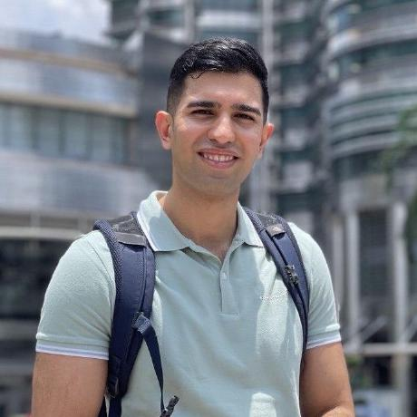

Autonomous agents powered by Large Language
Models are reshaping software engineering, enabling AI systems
that plan, code, test, and deploy with less human intervention. Despite rapid progress and growing industry interest, the Software
Engineering community lacks a dedicated venue to explore these
developments. The Autonomous Agents in Software Engineering
(AgenticSE) workshop aims to fill this gap by bringing together
researchers and practitioners to discuss agentic architectures,
applications in code generation, testing, DevOps, human-agent
collaboration, and evaluation. AgenticSE is a timely and essential
step toward building a community around this transformative
and underexplored direction in software engineering.

### Organizing Committee

  <figure style="text-align: center;">
    
    <figcaption>Maliheh Izadi, TU Delft</figcaption>
  </figure>

  <figure style="text-align: center;">
    
    <figcaption>Michael Pradel, Stuttgart</figcaption>
  </figure>

  <figure style="text-align: center;">
    
    <figcaption>Satish Chandra, Google</figcaption>
  </figure>

### Target Audience
- Software Engineering (SE): researchers and practitioners interested in AI-driven development, automation, program analysis, testing, maintenance, and DevOps. 

- Artificial Intelligence (AI): those working on LLMs, planning agents, multi-agent systems, and human-AI interaction. 

- Programming Languages (PL): experts in program synthesis, static analysis, compilers, and formal methods who can explore how agents reason about code and specifications.

- Human-Computer Interaction (HCI): researchers studying how developers interact with AI assistants/agents, UX design
for AI agents, and cognitive implications of AI partners. Systems and DevOps: practitioners in CI/CD and software infrastructure interested in autonomous agents for environment setup, deployment, monitoring, and optimization.

We expect a mix of academia and industry attendees. **Industrial participation** is highly encouraged (e.g., teams building
AI-powered developer tools and intelligent IDEs, autonomous bots in DevOps workflows, or automated project management). By drawing from multiple communities (AI, SE, PL, HCI), the workshop promotes diverse viewpoints and networking among groups that do not often overlap, seeding a new collaborative community.

### Format and Dates
Types of submissions include **full papers, short papers, and late-breaking talk-only (extended abstract)** submissions:

* **Long papers** = 8 pages in IEEEtran two-column formatting
* **Short papers** = 4 pages in IEEEtran two-column formatting
* **Talk-only**: Text-only abstract, without a formal publication

- **Paper submission**: Aug 22nd, 2025
- **Notification Date**: Sep 25th, 2025
- **Camera-ready deadline**: Oct 5th, 2025

### Review Procedure
All submitted papers will undergo peer-review process. Each paper will be reviewed by at least 3 PC members
to ensure multiple perspectives. We will follow a double-blind reviewing process. Reviewers will evaluate submissions
based on relevance to the workshop, technical quality, novelty/originality, and potential to stimulate discussion. Position
and vision papers might be judged more on insightfulness and
relevance than on new results, given the emerging nature of
the field.

### Program Committee

| Name | Affiliation | Country |
|------|-------------|-------------|
| [Ahmed Hassan](https://www.cs.queensu.ca/people/Ahmed%20E./Hassan) | Queen's University | Canada |
| [Ankit Agrawal](https://ankit.website) | Saint Louis University | USA |
| [Chao Peng](https://chao-peng.github.io/) | ByteDance | China |
| [Christoph Treude](https://ctreude.ca/) | Singapore Management University | Singapore |
| [Gustavo Soares](https://www.microsoft.com/en-us/research/people/gsoares/) | Microsoft | USA |
| [He Ye](https://heye.me/) | University of College London | UK |
| [Iftekhar Ahmed](https://ics.uci.edu/~iftekha/) | University Of California, Irvine | USA |
| [Ipek Ozkaya](https://insights.sei.cmu.edu/authors/ipek-ozkaya/) | Carnegie Mellon Software Engineering Institute | USA |
| [Islem Bouzenia](https://www.software-lab.org/people/Islem_Bouzenia.html) | University of Stuttgart | Germany |
| [Jie M. Zhang](https://sites.google.com/view/jie-zhang/home) | King's College London | UK |
| [Jingxuan He](https://jxhe.info/) | UC Berkeley | USA |
| [Jonathan Katzy](http://JKatzy.nl) | Delft University of Technology | Netherlands |
| [Jürgen  Cito](https://ipa-lab.github.io/) | TU Wien | Austria |
| [Qinghua Lu](https://people.csiro.au/L/Q/Qinghua-Lu) | CSIRO | New Zealand |
| [Sarah D'Angelo](https://research.google/people/108096/?&type=google) | Google | Australia |
| [Timofey Bryksin](https://bryksin.me/) | JetBrains Research | Cyprus |
| [Tse-Hsun (Peter) Chen](https://petertsehsun.github.io/) | Concordia University | Canada |
| [Yiling Lou](https://yilinglou.github.io/) | Fudan University | China |
| [Ziyou Li](http://ziyou.li) | Delft University of Technology |  Netherlands |

### Support Team

  <figure style="text-align: center;">
    
    <figcaption>Mehdi Keshani, Proceeding Chair</figcaption>
  </figure>

  <figure style="text-align: center;">
    
    <figcaption>Razvan Popescu, Web Chair</figcaption>
  </figure>

  <figure style="text-align: center;">
    
    <figcaption>Roham Koohestani, Web Chair</figcaption>
  </figure>

### Publication of Proceedings
We intend for accepted papers to be published in the ASE 2025 workshop proceedings. ASE workshop track home: [https://conf.researchr.org/track/ase-2025/ase-2025-workshops](https://conf.researchr.org/track/ase-2025/ase-2025-workshops).

### Submission Link
Submission site: [https://agenticse2025.hotcrp.com/](https://agenticse2025.hotcrp.com/)

For more info or questions reach out to m[dot]izadi[at]tudelft.nl

